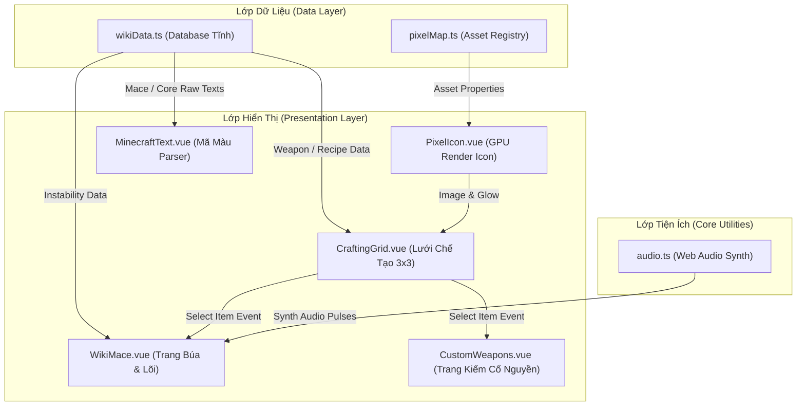

# 🏛️ Kiến Trúc Hệ Thống & Nguyên Lý Thiết Kế (System Architecture & Extension Blueprint)

Tài liệu này mô tả chi tiết kiến trúc phần mềm, cấu trúc dữ liệu, luồng xử lý (Data Flow), và các kỹ thuật tối ưu hóa front-end của dự án **Hội Hè SMP Wiki**. Đây là hướng dẫn kỹ thuật dành cho các Senior Developer để bảo trì và mở rộng hệ thống một cách nhất quán.

---

## 🧭 1. Triết Lý Thiết Kế & Clean Architecture

Dự án tuân thủ triết lý **Separation of Concerns (SoC)** và chia tách mã nguồn thành 3 phân lớp độc lập, giúp cô lập dữ liệu nghiệp vụ khỏi logic hiển thị:



### 1.1. Lớp Dữ Liệu (Data Layer)
*   [wikiData.ts](file:///b:/__JAVA__/hoiihesmp-web/src/data/wikiData.ts): Đóng vai trò là "Single Source of Truth" cho toàn bộ thông tin của Wiki (Búa, Lõi ma pháp, Vật liệu, Công thức). Dữ liệu được cấu trúc chặt chẽ thông qua các TypeScript `interface` (`Weapon`, `Recipe`, `Core`, `Material`). Không chứa mã HTML hoặc mã hiển thị thô.
*   [pixelMap.ts](file:///b:/__JAVA__/hoiihesmp-web/src/data/pixelMap.ts): Đăng ký toàn bộ ánh xạ định danh vật phẩm (`itemId`) sang tài nguyên ảnh PNG chính thức hoặc CDN avatar (`minotar.net` / `minecraftitems.xyz`). Lớp này cũng định nghĩa màu ánh sáng phù phép (`glowColor`) riêng biệt cho từng món đồ.

### 1.2. Lớp Hiển Thị (Presentation Layer)
*   **`PixelIcon.vue`**: Nhận `itemId` và chịu trách nhiệm vẽ icon vật phẩm. Nó giải quyết triệt để bài toán render hàng ngàn pixel DOM bằng cách sử dụng các hình ảnh PNG tối giản kết hợp với CSS Filter/Mask.
*   **`CraftingGrid.vue`**: Linh hồn của giao diện rèn đúc. Nó nhận ma trận công thức `Recipe` (dạng mảng 2D 3x3) và tự động lắp ghép các `PixelIcon` tương ứng. Giao tiếp với trang cha thông qua mô hình Event-Driven (`defineEmits` sự kiện `select-item`).
*   **`MinecraftText.vue`**: Bộ phân giải mã màu động. Nó duyệt chuỗi và chuyển hóa các ký hiệu màu cổ điển của Minecraft (như `&a`, `&b`, `&d`, `&l`, `&r`) thành các thẻ HTML với thuộc tính CSS tương ứng một cách an toàn (tránh XSS).

---

## ⚡ 2. Các Giải Pháp Tối Ưu Hóa & Kỹ Thuật Đặc Đặc Trưng

### 2.1. Enchanted Glow Mask (Hiệu ứng lấp lánh phù phép bằng GPU)
Để hiển thị hiệu ứng lấp lánh (Glow Effect) cho các vũ khí được phù phép mà không làm tăng số lượng DOM Node (gây giật lag khi di chuột trên thiết bị yếu), hệ thống sử dụng kỹ thuật **CSS Mask-Image**:
- Thay vì vẽ một layer lấp lánh hình vuông đè lên, chúng ta dùng thuộc tính `mask-image: url(...)` chỉ tới chính ảnh PNG gốc của vật phẩm đó.
- Một dải gradient chuyển động chạy tuần hoàn bên dưới lớp mặt nạ này. Kết quả là chỉ có các vùng pixel có màu của vật phẩm mới nhận hiệu ứng lấp lánh.
- Toàn bộ quá trình tính toán chuyển động và cắt mặt nạ được đẩy trực tiếp lên **GPU** xử lý thông qua CSS Keyframes, mang lại trải nghiệm 60fps mượt mà.

### 2.2. Web Audio API Synthesizer (Tổng hợp âm thanh lập trình)
Dự án hoàn toàn không sử dụng các file `.mp3` hay `.wav` bên ngoài. Việc này vừa loại bỏ độ trễ tải mạng (network latency), vừa giải quyết vấn đề bản quyền và dung lượng bundle. Thay vào đó, chúng ta tổng hợp âm thanh dạng sóng trực tiếp (Procedural Audio):
- **Âm thanh Click gỗ**: Sử dụng bộ dao động sóng Sine quét nhanh tần số từ `140Hz` xuống `60Hz` chỉ trong `0.04` giây.
- **Âm thanh Mở rương**: Sử dụng hai bộ tạo sóng tam giác (`triangle`) chạy lệch nhau `0.04s` để giả lập tiếng kêu lách cách cơ học của khớp gỗ và tiếng cọ xát bản lề rương.

### 2.3. Tối ưu Layout & Blocky UI
- Hạn chế tối đa các góc bo tròn phức tạp (`rounded-none`). Việc này không những tạo ra cảm giác hoài cổ (retro) chân thực, mà còn giúp trình duyệt vẽ các khối phẳng cực nhanh, giảm tải các phép tính chống răng cưa (anti-aliasing) trên viền bo góc.

### 2.4. Phân Bổ Tầng Trang & Sidebar Reorganization (Page Hierarchy & Emojis)
Để tối ưu hóa trải nghiệm người dùng và tránh xung đột điều hướng, toàn bộ hệ thống tab cũ của component `WikiMace.vue` đã được lôi ra thành các trang con độc lập được quản lý bởi VitePress sidebar:
*   **Búa Exclusive**: `/wiki/mace-exclusive` (kích hoạt `weapons`)
*   **Giáo Exclusive**: `/wiki/spear-exclusive` (kích hoạt `spears`)
*   **Lõi Ma Pháp**: `/wiki/cores` (kích hoạt `cores`)
*   **Vật Liệu Lò Rèn**: `/wiki/materials` (kích hoạt `materials`)
*   **Lò Rèn Lodestone**: `/wiki/forge` (kích hoạt `forge`)
*   **Hướng Dẫn Chế Tạo**: `/wiki/guide` (kích hoạt `guide`)

Các trang con này truyền prop `defaultTab` tương ứng vào `<WikiMace>` để kích hoạt trực tiếp tab đó. Menu tab điều hướng cũ phía trên cùng đã được ẩn đi, giúp giao diện trực quan và đồng bộ hoàn toàn với thanh định vị chính của VitePress.
Đồng thời, toàn bộ các emoji tiêu đề (như `🔊` trên Warden Spear) đã bị loại bỏ hoàn toàn, thay thế bằng các icon vật phẩm Minecraft chất lượng cao qua `<PixelIcon>` để giữ tính chuyên nghiệp của hệ thống.

---

## 🚀 3. Hướng Dẫn Mở Rộng Hệ Thống (Maintainer Guidelines)

### 3.1. Thêm một Vũ Khí / Công thức mới
Khi có vũ khí mới từ plugin server, hãy thực hiện theo đúng thứ tự 3 bước sau để đảm bảo tính nhất quán của Clean Architecture:

1.  **Đăng ký Asset** trong [pixelMap.ts](file:///b:/__JAVA__/hoiihesmp-web/src/data/pixelMap.ts):
    ```typescript
    export const itemAssetMap: Record<string, ItemAsset> = {
      // ...
      new_spear_id: { 
        cdnName: "trident", 
        type: "item", 
        displayName: "Giáo Thần Binh", 
        glowColor: "rgba(85, 255, 255, 0.4)" 
      }
    };
    ```
2.  **Định nghĩa Dữ liệu** trong [wikiData.ts](file:///b:/__JAVA__/hoiihesmp-web/src/data/wikiData.ts):
    Thêm phần tử vào mảng `maceWeapons` hoặc `customWeapons` tuân thủ kiểu định nghĩa `Weapon`:
    ```typescript
    {
      id: "new_spear_id",
      name: "Giáo Thần Binh",
      enName: "Divine Spear",
      badge: "🔱",
      colorClass: "border-[#55ffff]",
      cmd: 9001,
      singleton: true,
      desc: "Mô tả ngắn gọn về nguồn gốc vũ khí.",
      tooltip: "&b&lDivine Spear|&7Lore mô tả dòng 1.||&6⚡ Active:|&fChiêu thức kích hoạt...||&c☠ Curse:|&fHiệu ứng nguyền rủa...",
      recipe: {
        shape: [
          ["", "I", ""],
          ["", "S", ""],
          ["", "S", ""]
        ],
        ingredients: {
          I: { name: "Thỏi Sắt", itemId: "iron_ingot", tooltip: "&fIron Ingot" },
          S: { name: "Gậy", itemId: "stick", tooltip: "&fStick" }
        }
      }
    }
    ```
3.  **Xác minh & Build**: Hệ thống biên dịch tĩnh VitePress sẽ tự động quét qua dữ liệu mới và cập nhật giao diện mà không cần chỉnh sửa bất kỳ Vue component hiển thị nào.
